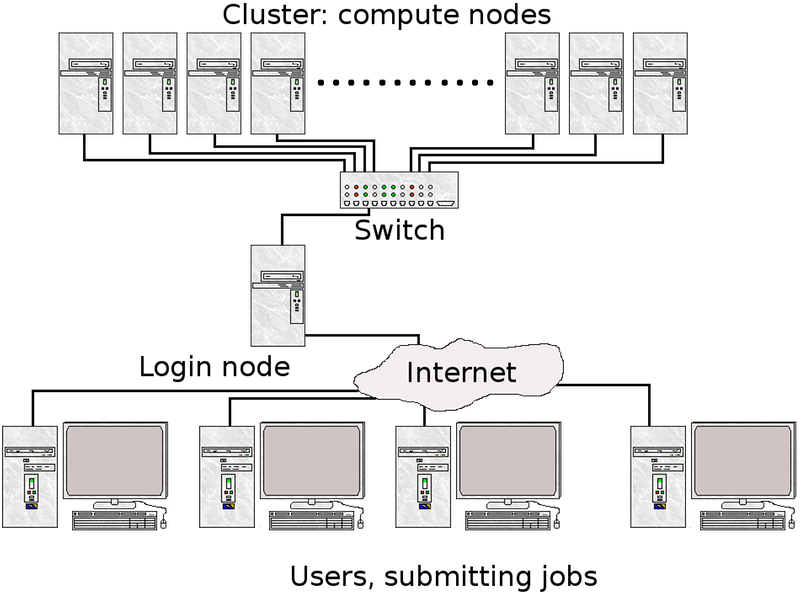
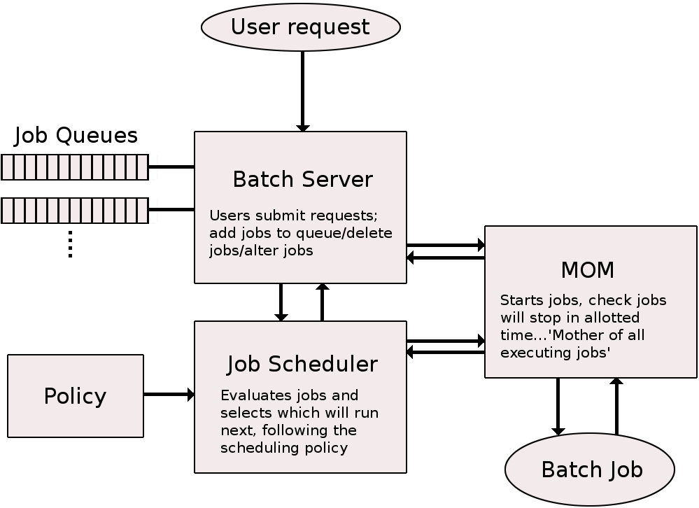
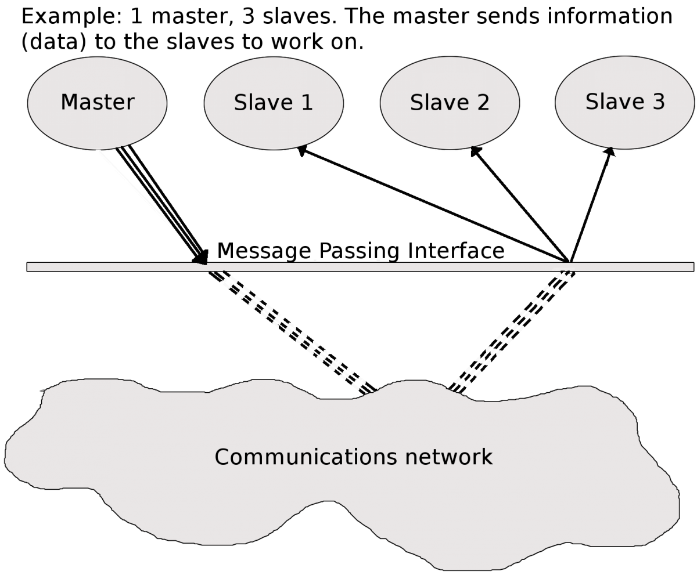
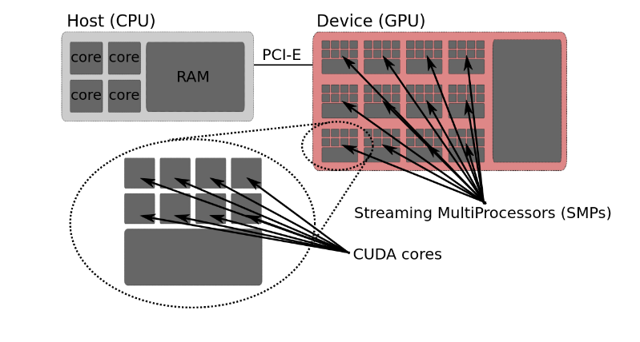

# Introduction to clusters

This section is a beginner's guide to clusters, and provides general information
about computer clusters like Tetralith, Dardel, Cosmos, Rackham, Kebnekaise and
other HPC systems, but is not directly focused on any of them.

## What is a cluster

A computer cluster consists of a number of computers (few or many), linked
together and working closely together. In many ways, the computer cluster works
as a single computer. Generally, the component-computers are connected to each
other through fast local area networks (LANs).

The advantage of computer clusters over single computers, are that they usually
improves the performance (and availability) greatly, while still being cheaper
than single computers of comparable speed and size.

{: style="width: 400px;float: right"}

### What is a node?

A node is the name usually used for one unit (usually one computer) in a
computer cluster. Generally, this computer will have one or two CPUs, each
normally with (many) more than one core. The memory is always shared between
cores on the same CPU, but generally not between the CPUs. Parallelization
across multiple cores on the same CPU is called **multi-threading**.

Programs using only multi-threaded, shared memory programming interfaces, like
OpenMP, are not always best-suited for clusters unless there are many cores per
CPU and each CPU has a lot of memory. Computer nodes can also have GPUs in
addition to the CPUs.

Nodes in computer clusters are usually arranged in racks at a dedicated
facility.

Normally, clusters have some sort of batch or queuing system to handle the jobs,
as well as a communication network.

With few exceptions, all computer clusters are running Linux.

## What is a Supercomputer? Is it the same as a Cluster?

A supercomputer is simply a computer with a processing capacity (generally
calculation speed) several orders of magnitude better than a typical personal
computer. For many years, supercomputers were single computers with many CPUs
and usually large volumes of shared memory---sometimes built specifically for a
certain task. They have often been custom-built machines, like Cray, and still
sometimes are. However, since desktop computers have become cheaper, most
supercomputers today are made up of many "off the shelf" ordinary computers
connected in parallel.

A supercomputer is not the same as a computer cluster, though a computer
cluster is often a supercomputer.

## How is a job run on a computer cluster? What is a batch system?

{: style="width: 400px;float: right"}

In general, jobs are run with a batch- or queueing system. There are several
variants of these, with the most common working by having the user log into a
"login node" and then assembling and submitting their jobs from there.

A "job script" (also called a "submission script") will typically be used to
start a job. A job script is essentially a list of commands to the batch system
telling it things like: how many nodes to use, how many CPU and/or GPU cores,
how much memory, how long to run, the program name, any input data, etc. When
the job has finished running, it should have produced some files, like output
data, perhaps error messages, etc.

Since jobs are queued internally and will run whenever the resources for them
become available, programs requiring any kind of user interaction are usually
not recommended (and often not possible) to be run via a job script. There are
special programs like Desktop On-Demand and GfxLauncher that allow graphical
programs to be run as scheduled jobs on some HPC clusters, but it is up to the
administrators to decide which programs can be run with these tools, how they
should be configured, and what options regular users will be allowed to set.

## Which programs can be run effectively on a computer cluster?

Computer clusters are made up of many interconnected nodes, each with a limited
number of cores and limited memory capacity. A problem must be parallellizeable
in order to get any speed-up.

Parallelization can be done in several ways. The simplest method is what would
usually be done for a parameter sweep: just run the program repeatedly for every
desired combination of input parameters. Each task is the same serial program
running on a single core, but many copies of the task are running at the same
time. Another option is to use a more complex parallelization that requires
changes to the program to split its work between multiple processors or nodes
that communicate over the network. This is generally done with MPI or similar.
It is also possible to parallelize over multiple cores and multiple nodes at the
same time, e.g., using multi-threading *within* CPUs and communicating *between*
nodes with MPI.

### Many serial jobs

Tasks that can be split up into many serial jobs will run faster on a computer
cluster. No special programming is needed, but you can only run on one core for
each task. It is good for long-running single-threaded jobs.

A job scheduler is used to control the flow of tasks. Using a small script, many
instances of the same task (like a program run many times, each with slightly
different parameters) can be set up. The tasks will be put in a job queue, and
will run as free spaces open up in the queue. Normally, the tasks will run many
at a time, since they are serial, which means each only uses one core.

!!! Example

    You launch 500 tasks (say, run a small program for 500 different temperatures).
    There are 50 cores on the machine in our example, that you can access. Fifty
    instances are started and then run, while the remaining 450 tasks wait. When
    the running programs finish, the next 50 will start, and so on.
    
    It will be is as if you ran on 50 computers instead of one, and you will finish
    in 1/50th of the time.
    
    Of course, this is an ideal example. In reality there may be overhead, waiting
    time between batches of jobs, etc. so the speed-up will not be as great, but it
    will certainly run faster.

### MPI (Message Passing Interface

{: style="width: 400px;float: right"}

In order to take advantage of more than one core per job and get speed-up this
way, you need to do some extra programming. In return, the job will be able to
run across several processors that communicate over the local network.

MPI is a language-independent communications protocol used to program parallel
computers. There are several MPI implementations, but most of them consists of a
set of routines that can be called from Fortran, C, C++, and Python, as well as
any language that can interface with their libraries. MPI is very portable and
generally optimized for the hardware it runs on, so it will be reasonably fast.

Programs that are parallelizable should be reasonably easy to convert to MPI
programs by adding MPI routines to it.

#### What kinds of programs can be parallelized?

For a problem to be parallelizable, it must be possible to split it into smaller
sections that can be solved independently of each other and then combined.

What happens in a parallel program is generally the following:

- A "master" processes is created to control distribution of data and tasks. 
- The "master" sends data and instructions to one or more "slave" processes that do the calculations.
- The "slave" processes then send the results back to the "master".
- The "master" combines the results and/or may send out further subsections of the problem to be solved.

Examples of parallel problems:

- Sorting
- Rendering computer graphics
- Computer simulations comparing many independent scenarios, like climate models
- Matrix Multiplication

### Shared memory

Shared memory is memory that can be accessed by several programs at the same
time, enabling them to communicate quickly and avoid redundant copies. Shared
memory generally refers to a block of RAM accessible by several cores in a
multi-core system. Computers with large amounts of shared memory and many cores
per node are well suited for threaded programs, using OpenMP or similar.

Computer clusters built up of many off-the-shelf computers usually have smaller
amounts of shared memory and fewer cores per node than custom-built single
supercomputers. This means they are more suited for programs using MPI than
OpenMP. However, the number of cores per node is going up and many-core chips
are now common. This means that OpenMP programs as well as programs combining
MPI and OpenMP are often advantageous.

### GPUs

Many computer clusters now have GPUs in several of their nodes that jobs may
take advantage of.

Originally, GPUs were used for computer graphics, but now they are also used
extensively for general-purpose computing (GPGPU computing).

<figure class="inline end" markdown>

<figcaption>Image from NVidia</figcaption>
</figure>

GPU-driven parallel computing is, among other things, used for:

- scientific modelling
- machine learning
- graphical rendering

and other parallelizable jobs.

#### Difference between CPUs and GPUs

CPUs (Central Processing Units) are latency-optimized general-purpose processors
designed to handle a wide range of distinct tasks sequentially.

GPUs (Graphics Processing Units) are throughput-optimized specialized processors
designed for high-end parallel computing.

Whether you should use a CPU, a GPU, or both depends on the specifics of the
problem you are solving.

#### Using GPUs

{: style="width: 400px;float: right"}

Programs must be written especially for GPUs in order to use them.

Several programming frameworks handle the graphical primitives that GPUs
understand, like CUDA (Compute Unified Device Architecture), OpenCL, OpenACC,
HIP, etc.

In addition to the above programming frameworks, you often have the option to
use software that is already prepared for use on GPUs. This includes many types
of MD software, Python packages, and others.

