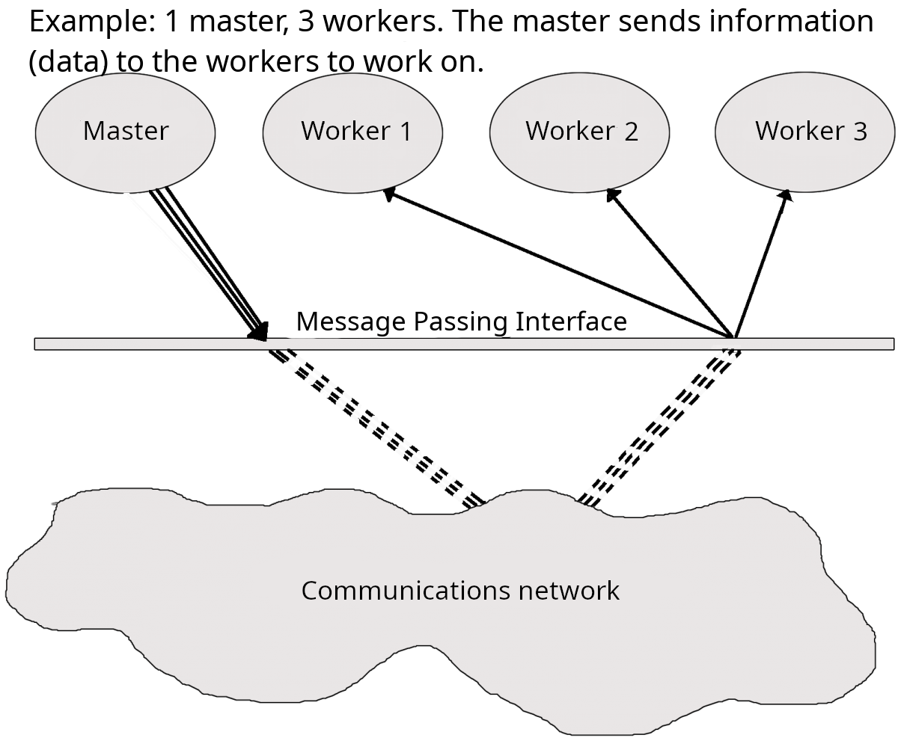

# MPI (Message Passing Interface

{: style="width: 400px;float: right"}

In order to take advantage of more than one core per job and get speed-up this way, you need to do some extra programming. In return, the job will be able to run across several processors that communicate over the local network - distributed parallelism.

MPI is a way of doing distributed parallelism. 

MPI is a language-independent communications protocol used to program parallel computers. There are several MPI implementations, but most of them consists of a set of routines that can be called from Fortran, C, C++, and Python, as well as any language that can interface with their libraries. MPI is very portable and generally optimized for the hardware it runs on, so it will be reasonably fast.

Programs that are parallelizable should be reasonably easy to convert to MPI programs by adding MPI routines to it.

## What kinds of programs can be parallelized?

For a problem to be parallelizable, it must be possible to split it into smaller sections that can be solved independently of each other and then combined.

What happens in a parallel program is generally the following:

- A "master" process is created to control the distribution of data and tasks.
- The "master" sends data and instructions to one or more "worker" processes that do the calculations.
- The "worker" processes then send the results back to the "master".
- The "master" combines the results and/or may send out further subsections of the problem to be solved.

Examples of parallel problems:

- Sorting
- Rendering computer graphics
- Computer simulations comparing many independent scenarios, like climate models
- Matrix Multiplication

