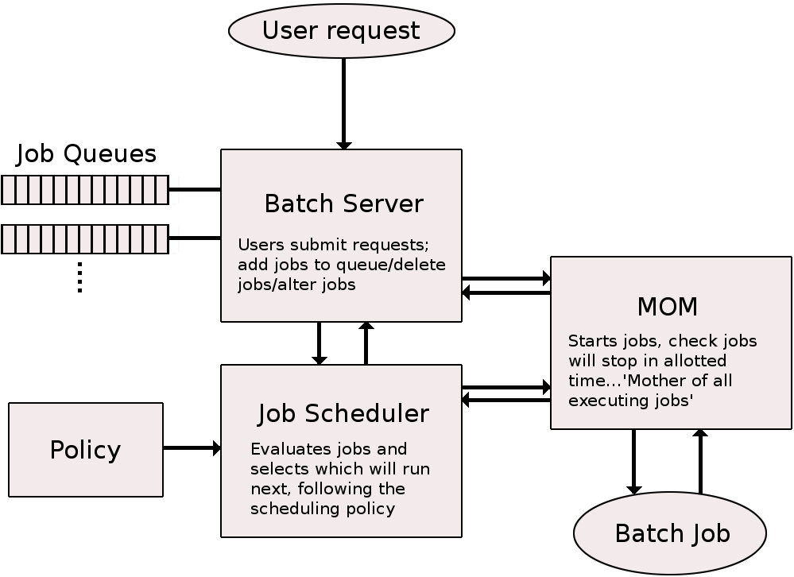
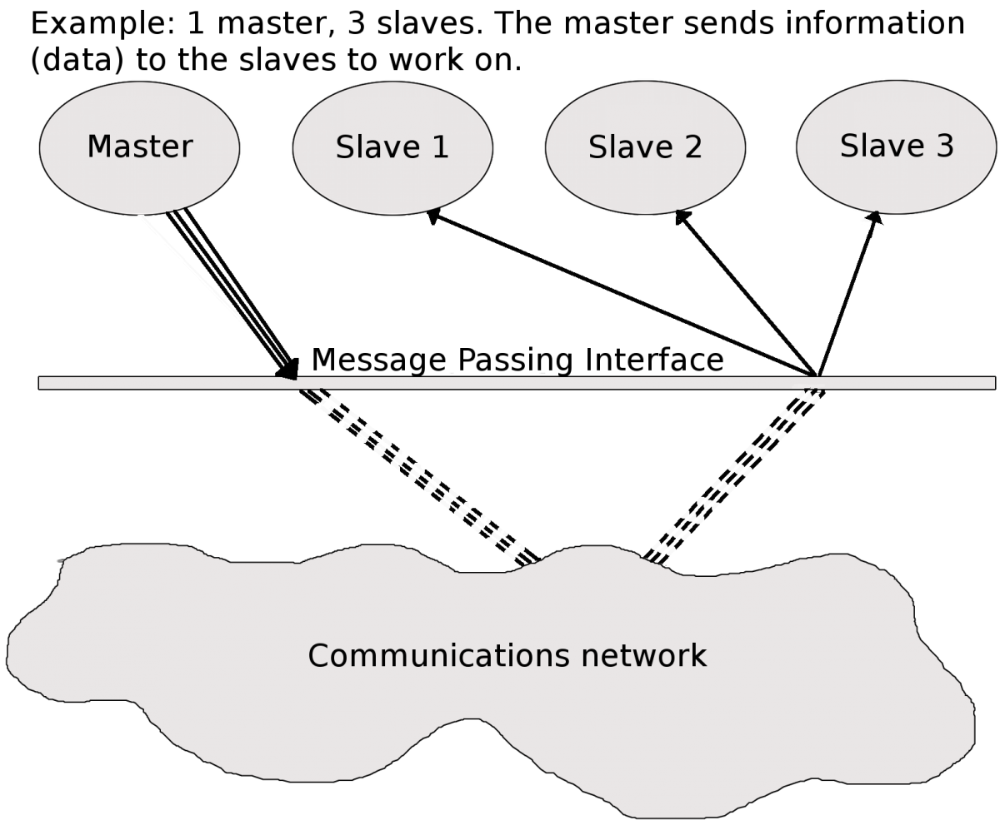

# Beginner's intro to clusters

This section is a beginner's guide to clusters, and provides general information about computer clusters like Kebnekaise and other HPC systems, but not directly focused on Kebnekaise. 

## What is a cluster

A computer cluster consists of a number of computers (few or many), linked together and working closely together. In many ways, the computer cluster works as a single computer. Generally, the component-computers are connected to each other through fast local area networks (LANs).

The advantage of computer clusters over single computers, are that they usually improves the performance (and availability) greatly, while still being cheaper than single computers of comparable speed and size.

{: style="width: 400px;float: right"}

### What is a node?

A node is the name usually used for one unit (usually one computer) in a computer cluster. Generally, this computer will have one or two CPUs, each normally with (many) more than one core. The memory is always shared between cores on the same CPU, but generally not between the CPUs. This means programs using only multi-threaded, shared memory programming interfaces, like OpenMP, is not always suited for clusters, unless there are many cores per CPU and much memory per CPU. Computer nodes can also have GPUs in addition to the CPUs. 

Nodes in computes clusters are usually arranged in racks. 

Normally, clusters have some sort of batch or queueing system to handle the jobs, as well as a communication network.

With few exceptions, all computer clusters are running Linux.

## What is a Supercomputer? Is it the same as a Cluster?

A supercomputer is simply a computer with a processing capacity (generally calculation speed) high enough to be considered at the forefront of today. For many years, this has been single computers with many CPUs and usually shared memory - sometimes built specifically for a certain task. They have often been custom-built machines, like Cray, and still sometimes is. However, as desktop computers have become cheaper, most supercomputers today are made up of many "off the shelf" ordinary computers, connected in parallel.

So, a supercomputer is not the same as a computer cluster, though a computer cluster is often a supercomputer.

## How is a job run on a computer cluster? What is a batch system? 

{: style="width: 400px;float: right"}

In general, jobs are run with a batch- or queueing system. There are several variants of these, with the most common working by the user logging into a "login node" and then putting together and submitting their jobs from there.

In order to start the job, a "job script" will usually be utilised. In short, it is a list of commands to the batch system, telling it things like: how many nodes to use, how many CPU cores, how much memory, how many GPUs, how long to run, program name, any input data, etc. When the job has finished running, it will have produced a number of files, like output data, perhaps error messages, etc.

Since the jobs are queued in the system and will run when they are able to get a free spot, it is not generally a good idea (and often not possible) to run programs that require any kind of user interaction, like some graphical programs.

## Which programs can be run effectively on a computer cluster? 

Computer clusters are built up of many connected nodes, with a limited number of cores and memory each. In order to get a speed-up, the problem must be parallelliseable.

This can be done in several ways. A simple way is to just divide it into smaller parts, and then run the program many times for variations of parameters on your input data. The tasks are each serial programs, running on one core each, but many instances are running at the same time. Another option is to use a more complex parallelisation that requires changes done to the program, in order to allow it to be split between several processors/nodes, that communicate over the network. This is generally done with MPI or similar.

### Many serial jobs

Tasks that can be split up into many serial jobs will run faster on a computer cluster.

No special programming is needed, but you can only run on one core for each task. It is good for long-running single-threaded jobs.

A job scheduler is used to control the flow of tasks. Using a small script, many instances of the same task (for instance a program, each time run with slightly different parameters) can be set up. The tasks will be put in a job queue, and will run as free spaces open up in the queue. Normally, the tasks will run many at a time, since they are serial and so each only use one core.

!!! Example

    You send out 500 tasks (say, run a small program for 500 different temperatures). 
    There are 50 cores on the machine in our example, that you can access. 50 instances are started and then run, while the remaining 450 tasks wait. 
    When the running programs finishes, the next 50 will start, and so on. 
    This means it is as if you ran on 50 computers instead of one, and you will finish in a fiftieth the time. 
    Of course, this is an ideal example. In reality there may be overhead, waiting time between batches of jobs starting, etc. meaning the speed-up is not as great, but it will certainly run faster.

### MPI (Message Passing Interface

{: style="width: 400px;float: right"}

In order to take advantage of more than one core per job and get speed-up this way, you need to do some extra programming. In return, the job can run across several processors that communicate over the local network.

MPI is a language-independent communications protocol used to program parallel computers. There are several MPI implementations, but most of them consists of a set of routines that are callable from Fortran, C, C++, and Python, as well as any language that can interface with their libraries. MPI is very portable and it is generally optimized for the hardware it runs on, so will be reasonably fast.

Programs that are parallelizable should be reasonably easy to convert to MPI programs by adding MPI routines to it.

#### Which programs are parallelizable?

In order for a problem to be parallelizable, it must be possible to split it into smaller sections that can be solved independently of each other and then combined.

What happens in a parallel program is generally this: 

- There is a 'master' processes that controls splitting out the data etc. and communicate it to one or more 'slave' processes that does the calculations. 
- The 'slave' processes then sends the results back to the 'master'. 
- It combines them and/or perhaps sends out further subsections of the problem to be solved.

Examples of parallel problems:

- Sorting
- Rendering of computer graphics
- Computer simulations comparing many independent scenarios, like climate models
- Matrix Multiplication

### Shared memory 

Shared memory is memory that can be accessed by several programs at the same time, enabling them to communicate quickly and avoid redundant copies. Generally, shared memory refers to a block of RAM accessible by several cores in a multi-core system. Computers with large amounts of shared memory, and many cores per node are well suited for threaded programs, using OpenMP and similar.

Computer clusters built up of many off-the-shelf computers usually have a smaller amount of shared memory and fewer cores per node than custom built single supercomputers. This means they are more suited for programs using MPI than OpenMP. However, the number of cores per node is going up and many-core chips are now common. This means that OpenMP programs as welll as programs combining MPI and OpenMP are often advantageous.

### GPUs

Many computer clusters now have GPUs in several of their nodes, which means that jobs can take advantage of this. 

Originally, GPUs were used for computer graphics, but now they are also used extensively for general-purpose computing (GPGPU computing). 

<figure class="inline end" markdown>

<figcaption>Image from NVidia</figcaption>
</figure>

GPU-driven parallel computing is among others used for:  

- scientific modelling
- machine learning
- graphical rendering

and other parallelizable jobs. 

#### Difference between CPUs and GPUs

CPUs (Central Processing Units) are latency-optimized general-purpose processors designed to handle a wide range of distinct tasks sequentially.

GPUs (Graphics Processing Units) are throughput-optimized specialized processors designed for high-end parallel computing.

Whether you should use a CPU, a GPU, or both depends on the specifics of the problem you are solving. 

#### Using GPUs

{: style="width: 400px;float: right"}

In order for programs to use the GPUs, they need to be written for them. 

Several programming framworks handle the graphical primitives GPUs understand, like CUDA (Compute Unified Device Architecture), OpenCL, OpenACC, HIP... 

In addition to using the above programming frameworks, you often have the option to use software that is already prepared for use on GPUs. This includes many types of MD software, a variety of Python packages, and many others. 

## Batch/scheduling systems 

Once a parallel program has been successfully compiled it can be run on multi-processor/multi-core computing nodes directly or, in production environment, by means of a batch system. Batch systems keeps track of available system resources and takes care of scheduling jobs of multiple users running their tasks simultaneously. It typically organizes submitted jobs into a three-part priority queue (running, idle, blocked). The batch system is also used to enforce local system resource usage and job scheduling policies.

### Job scripts 

In order to submit a job to the batch system, you generally use a job script. This is a shorter or longer list of commands, both to the batch system itself (number of nodes/cores/GPUs to use, memory requirements, etc.), and commands that would otherwise be entered at the command line, like changing directories. When the job has completed, the output can be accesses. Likewise, any errors that happened will be logged in an error-file, which may be studied afterwards.

A common open source job scheduling system is <a href="https://en.wikipedia.org/wiki/Slurm_Workload_Manager" target="_blank">SLURM</a> (Simple Linux Utility for Resource Management) that runs on Linux and Unix-like kernels. It is used by many of the world's supercomputers and compute clusters. 

It provides three key functions:

- allocating exclusive and/or non-exclusive access to resources (computer nodes) to users for some duration of time so they can perform work,
- providing a framework for starting, executing, and monitoring work, typically a parallel job such as Message Passing Interface (MPI) on a set of allocated nodes, and
- arbitrating contention for resources by managing a queue of pending jobs.

Directives to the SLURM batch system is preceeded with <code>#SBATCH</code> when written in a submit file. Comments are preceeded by <code>#</code>.

!!! Example "HPC2N"

    **Note** that the project ID MUST be formated as <code>SNICXXX-YY-ZZ</code>, <code>NAISSXXXX-YY-ZZ</code>, or <code>hpc2nXXXX-YYY</code> (spaces and slashes are not allowed in the project ID. The letters can be upper or lower case though). 

    Explanations of the most common SLURM directives can be found on the batch systems page, under the section [SLURM Submit File Design](../../documentation/batchsystem/#slurm__submit__file__design).    

!!! Example "SLURM submit file example"

    This example is for the Kebnekaise cluster at HPC2N, but very similar files would work for any cluster using the SLURM job scheduler. 

    ```bash
    #!/bin/bash
    # Project to run under (change to your own)
    #SBATCH -A hpc2nXXXX-YYY
    # Name of the job (easier to find in the status lists) 
    #SBATCH -J Parallel

    # The flag -n sets tasks, but since tasks per core is one as default, 
    # this means we ask for that number of cores - otherwise 
    # set --cpus-per-task (or -c in short format) to change this 
    # Here we thus ask for 1 core
    #SBATCH -n 1
    # Job walltime (HHH:MM:SS) - here 30 min for the job to run in
    #SBATCH --time=00:30:00

    # load any modules you need. This is specific to each center, but used in many places to load a specific software
    # In this example we load foss/2021b which is GCC compilers, OpenMPI, BLAS, etc. 
    ml foss/2021b

    # run the program. This is serial. If it was parallel you should preface with srun
    ./my_program
    ```

You can find many [examples for Kebnekaise here](../../documentation/batchsystem/#basic__examples__of__job__submission__files).

### Job submission

In SLURM, jobs are submitted with the command <code>sbatch</code>. If we assume your jobscript is called MYJOB.sh, the submission is done like this:

```bash
sbatch MYJOB.sh
```

There are other options, like giving the commands for number of nodes, cores, memory, walltime, etc. on the command line, or running an interactive job, which is mostly done for debugging purposes or during development.

You can find more information about [job submission at Kebnekaise here](../../documentation/batchsystem/#job__submission).

### Job status

It may take a while before a submitted job is allowed to run ([see policies](../../documentation/batchsystem/#batch__system__policies)), it may run for a long time, or it may not run at all because there are not sufficient resources available for what you have asked for. 

Therefore it is a good idea to check the status of a job. There are a number of commands for doing this:

- <code>squeue</code>: This gives a very long list of all jobs for all users. Bad if there are many jobs.
- <code>squeue -u USERNAME</code>: This only shows your own jobs (put your username instead of USERNAME in this command).
- <code>squeue -j JOBID</code>: Info just for a particular job with this JOBID. You get the JOBID when you submit your job or from the <code>squeue -u USERNAME</code> command.
- <code>scontrol show job JOBID</code>: More information about a particular job with JOBID, including a (rough) estimate of when the job starts.

More information can be found [here on the Job status page](../../documentation/batchsystem/#job__status).

### Cancelling a job

To stop the job before it finishes:

```bash
scancel JOBID
```

You get the JOBID from the <code>squeue -u USERNAME</code> command. The JOBID is also shown just after the job is submitted. 

## Compute clusters at HPC2N

<figure class="inline end" markdown>

<figcaption>Kebnekaise</figcaption>
</figure>


HPC2N currently only has one computer clusters. It is named Kebnekaise and is a heterogeneous cluster with both CPUs and GPUs. For more detailed information, look at <a href="https://www.hpc2n.umu.se/resources/hardware/kebnekaise" target="_blank">the Kebnekaise hardware page</a>.

### Getting an account

Information about applying for a user account at HPC2N can be found [on the Accounts page](../../documentation/accounts-rules/). You need to be a member of a project with time at Kebnekaise to have an account at HPC2N. Accounts are then applied for through <a href="https://supr.naiss.se/" target="_blank">SUPR</a>. 

In order to apply for a new project, see the information in the section [Projects](../../documentation/accounts-rules/#projects). 

### The file system

At HPC2N, the home directories are backed up regularly. The home directory is small (by default 25GB), and because of this they are not really suitable for storing your data in. 

You should run all your batch jobs from your project storage (/proj/nobackup/<your-storage-dir>). Likewise, your executables as well as all your data should be located in your storage project. You should only use your home directory for things that cannot easily be recreated, like configuration files, your own (or your groups) code, etc. You can read more about [the file systems here](../../documentation/filesystems).

### The local batch system

Kebnekaise at HPC2N run SLURM as batch scheduling system. 

As described further up on the page, it has a system resource manager (allocates and enforces limits on nodes, processors, memory, etc.), and a job scheduler (handles [job scheduling policies](../../documentation/batchsystem/#batch__system__policies)). 

The jobs are scheduled according to a set of policy rules and priorities which gives the user access as fairly as possible with respect to allotted resources.
 
